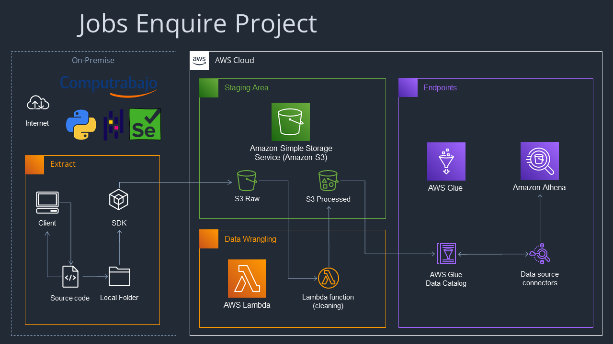

# JobPost - Project

## Review
This project collects information about job posts published in 'Computrabajo' and classiffy 3 tables in different aspects.
Those tables organize and structs many data relevant for the one whose purpose is searach for a job. The information structed
and stored at there like wheater require such programming language, english speaking, or domains certain software.

## Project Diagram

## Running the Project
'the project is only reproducible if you meet the following requirement in your premise'  
  
- python\==3.9  
- selenium
- chromium==
- pandas\==1.5.2
- numpy
